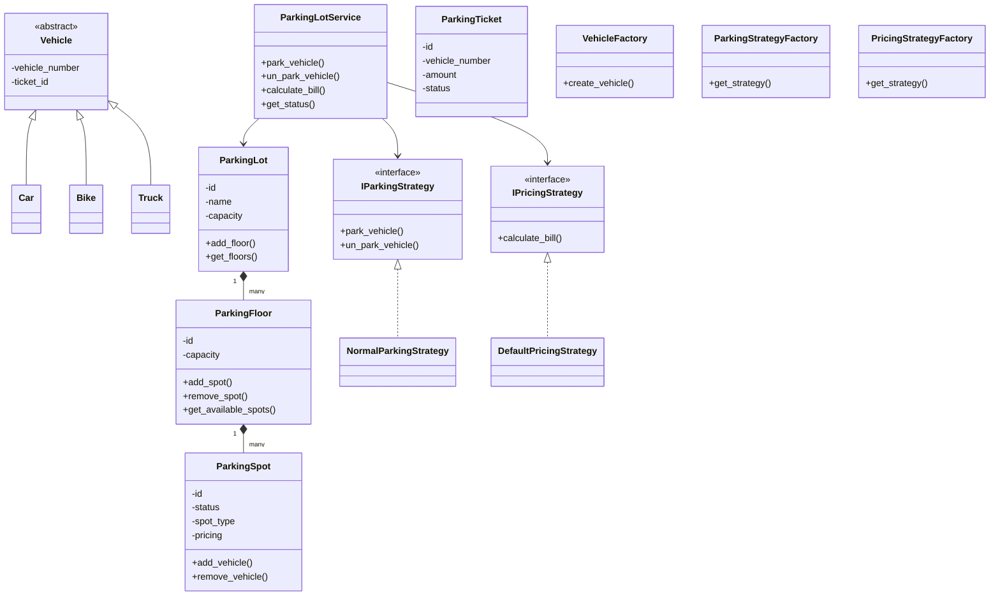

```mermaid
classDiagram
    ParkingLot "1" *-- "many" ParkingFloor
    ParkingFloor "1" *-- "many" ParkingSpot
    Vehicle <|-- Car
    Vehicle <|-- Bike
    Vehicle <|-- Truck
    IParkingStrategy <|.. NormalParkingStrategy
    IPricingStrategy <|.. DefaultPricingStrategy
    ParkingLotService --> ParkingLot
    ParkingLotService --> IParkingStrategy
    ParkingLotService --> IPricingStrategy
    
    class ParkingLot {
        -id
        -name
        -capacity
        +add_floor()
        +get_floors()
    }
    
    class ParkingFloor {
        -id
        -capacity
        +add_spot()
        +remove_spot()
        +get_available_spots()
    }
    
    class ParkingSpot {
        -id
        -status
        -spot_type
        -pricing
        +add_vehicle()
        +remove_vehicle()
    }
    
    class ParkingTicket {
        -id
        -vehicle_number
        -amount
        -status
    }
    
    class Vehicle {
        <<abstract>>
        -vehicle_number
        -ticket_id
    }
    
    class Car
    class Bike
    class Truck
    
    class IParkingStrategy {
        <<interface>>
        +park_vehicle()
        +un_park_vehicle()
    }
    
    class NormalParkingStrategy
    
    class IPricingStrategy {
        <<interface>>
        +calculate_bill()
    }
    
    class DefaultPricingStrategy
    
    class VehicleFactory {
        +create_vehicle()
    }

    class ParkingStrategyFactory {
        +get_strategy()
    }

    class PricingStrategyFactory {
        +get_strategy()
    }
    
    class ParkingLotService {
        +park_vehicle()
        +un_park_vehicle()
        +calculate_bill()
        +get_status()
    }
```
